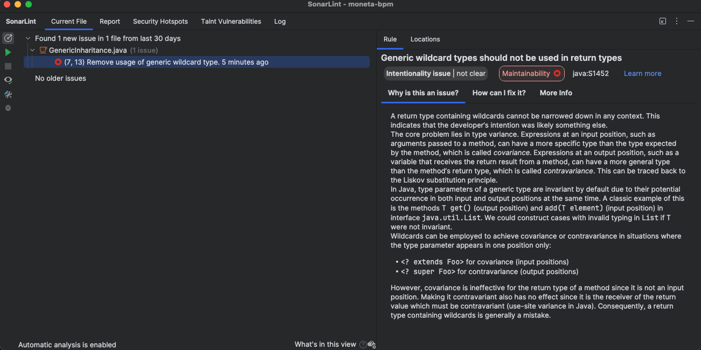
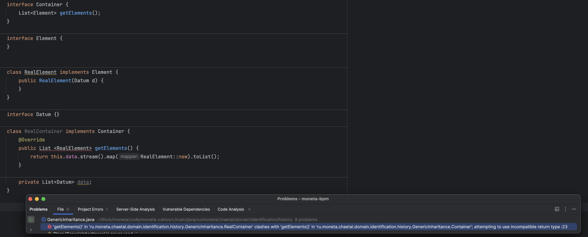
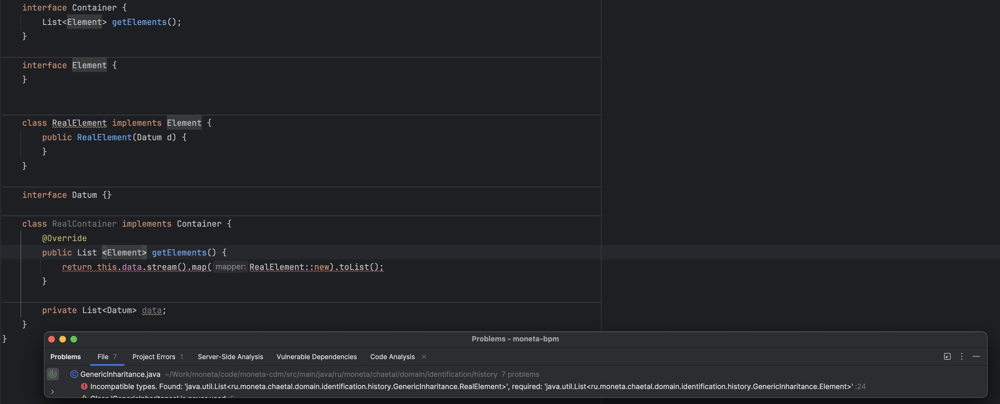

Мне нужен некоторый контейнер, который может хранить элементы. И у него может быть множество реализаций. Причём разные реализации могут быть как у контейнера, так и его элементов.

Я сначала сделал так:

```java
interface Container {  
    List<? extends Element> getElements();  
}  
  
interface Element {  
}  
```

И реализовал:

```java
class RealElement implements Element {  
    public RealElement(Datum d) {  
    }  
}  

class Datum {}  
  
  
class RealContainer implements Container {  
    @Override  
    public List <RealElement> getElements() {  
        return this.data.stream().map(RealElement::new).toList();  
    }  
  
    private List<Datum> data;  
}
```

Работает, но линтер ругается:



Не вдаваясь в подробности — смысл в том, что теория дженериков в Java гласит: дженерики c вайлдкардами можно использовать только во входных параметрах. В общем-то, обосновано в контексте того, как обобщённые типы сделаны в Java.

Меняем, как просят:

```java
interface Container {  
    List<Element> getElements();  
}
```

И это, естественно., ломает RealContainer:


Логично меняем выходной тип на `List<Element>` и получаем другую ошибку:


 
Тут мне пришлось потратить время на поиск решения, которое оказалось простым — использовать `.collect`:

```java
        return this.data.stream().map(RealElement::new).collect(Collectors.toList());  
```

"Волшебство" заключается в том, что `.collect(Collectors.toList())` параметризован более универсально, чем `.toList()`:

```java
 <R, A> R collect(Collector<? super T, A, R> collector);
```

против

```java
default List<T> toList()
```


Есть альтернативное решение, которое, к тому же обеспечивает ещё больше гибкости — (правильно) параметризовать исходный `Container`:

```java
interface Container<T extends Element>
```

И в этом случае, кстати, уже вполне подходит `.toList()`.

```java
    interface Container<T extends Element> {
        List<T> getElements();
    }

    interface Element {
    }


    class RealElement implements Element {
        public RealElement(Datum d) {
        }
    }

    interface Datum {}

    class RealContainer implements Container<RealElement> {
        @Override
        public List<RealElement> getElements() {
            //return this.data.stream().map(RealElement::new).toList();
            return this.data.stream().map(RealElement::new).toList();
        }

        private List<Datum> data;
    }
```


